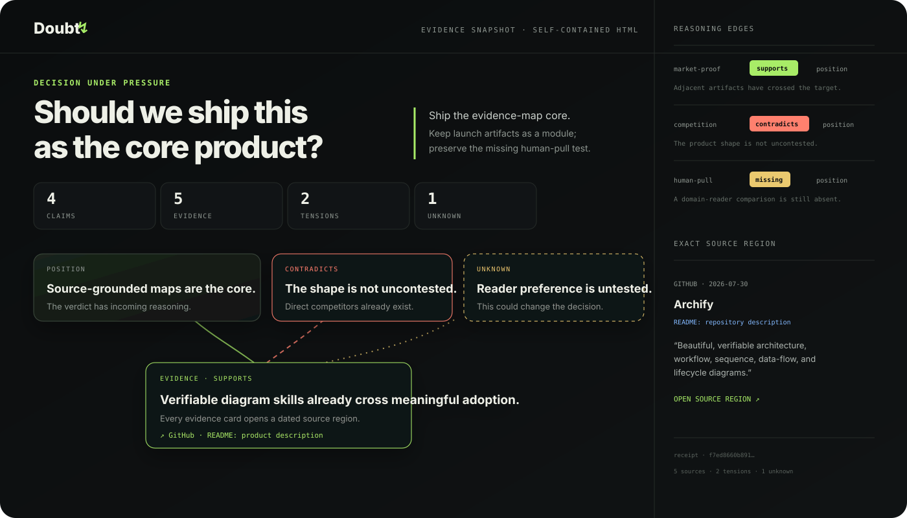

<div align="center">

# Doubt

### See what supports a conclusion, what contradicts it, and what is still missing.

**An Agent Skill and zero-dependency CLI for source-grounded, interactive evidence maps.**

[](LICENSE)
[](package.json)
[](package.json)
[](SECURITY.md)
[](https://github.com/alsoleg89/doubt/actions/workflows/ci.yml)
[](https://github.com/alsoleg89/doubt/actions/workflows/evidence.yml)

[**Try the zero-install playground →**](https://alsoleg89.github.io/doubt/playground/)
·
[**Test Agent Skills portability →**](https://alsoleg89.github.io/doubt/examples/agent-skills-portability.html)
·
[**Take the map-vs-memo study →**](https://alsoleg89.github.io/doubt/benchmark/)
·
[**Bring a contested question →**](https://github.com/alsoleg89/doubt/discussions/4)

If you want inspectable AI research to become a standard artifact,
[**star Doubt**](https://github.com/alsoleg89/doubt) and challenge one reasoning
edge.



</div>

AI research tools usually end with prose. Prose is good at sounding settled:
support and contradiction blur together, missing evidence becomes a footnote,
and a citation may merely mention the topic.

Doubt produces a different artifact:

- one falsifiable question and one provisional position;
- atomic claims, sourced observations, and explicit unknowns;
- typed `supports`, `contradicts`, `qualifies`, and `missing` edges;
- a dated URL or local path plus a section, page, timestamp, or line locator for
  every evidence node;
- one self-contained HTML file that stays inspectable without an account,
  server, or CDN.

## Try it in the browser

[**Open the local-only Doubt playground →**](https://alsoleg89.github.io/doubt/playground/)

Paste or drop a `.doubt.json` file to run the same evidence-contract module used
by the CLI, inspect exact findings, preview the interactive map, and download
portable JSON or HTML. Copy a share link to let another reader inspect the same
map without an upload: the payload lives in the URL fragment, which browsers do
not send in the HTTP request. Validation, SHA-256 receipts, rendering, and
downloads run in the tab; map content is never submitted over the network.

## Explore the evidence maps

- [**Are Agent Skills actually portable?**](https://alsoleg89.github.io/doubt/examples/agent-skills-portability.html)
  — one conservative core works across Claude Code, Codex, Copilot, Cursor,
  and Gemini CLI, but discovery paths, invocation, consent, permissions,
  metadata, and distribution still require per-host testing.
- [**Agent Skills vs MCP**](https://alsoleg89.github.io/doubt/examples/agent-skills-vs-mcp.html)
  — when a capability should be reusable procedure, a live protocol boundary,
  or both. Built from the Agent Skills specification, GitHub's implementation,
  the discovery RFC, and the current MCP architecture and security guidance.
- [**What should Doubt become?**](https://alsoleg89.github.io/doubt/examples/what-should-doubt-become.html)
  — the product decision that kept a distribution module, rejected it as the
  core, and preserved the missing reader-preference test.

All maps are committed as editable `.doubt.json`, validated with the same
evidence contract, and rendered as self-contained HTML.

## Try the real map

```bash
npx doubt-ai demo --out doubt-demo.html
```

The command renders the same decision used to choose Doubt's product direction:

> Is repository-to-launch-artifacts the strongest path to a community-scale
> open-source project?

Open `doubt-demo.html`, select an evidence card, and the exact source locator
appears beside the reasoning graph. The canonical editable input is
[plain JSON](examples/what-should-doubt-become.doubt.json); the generated
[self-contained HTML](examples/what-should-doubt-become.html) has no runtime
dependencies.

The public map is also the product decision record: it preserves the evidence
that killed two earlier directions and the human-preference test that is still
missing. The broader selection process started with
[105 AI open-source wedges](docs/category-research-2026.md) and narrowed them
through [direct competitor and prototype tests](docs/candidate-shortlist-2026.md).
The current [acquisition funnel](docs/acquisition-funnel.md) records the honest
traffic baseline, star-conversion scenarios, and stage gates toward broad adoption.

## Give the workflow to your agent

Install directly from GitHub with GitHub CLI 2.90 or later:

```bash
gh skill install alsoleg89/doubt doubt
```

Or install the portable skill into every supported local agent:

```bash
npx doubt-ai init --agent all
```

Then ask:

```text
Use $doubt to map whether we should replace our current auth provider.
Preserve contrary evidence and show the exact source region behind every edge.
```

The skill works with Claude Code, Codex, GitHub Copilot, Cursor, Gemini CLI, and
clients that support the open Agent Skills layout. It uses the research and
browsing capabilities the agent already has; Doubt does not proxy prompts or
require a model key. The checked-in
[remote-install skill](skills/doubt/SKILL.md) and
[GitHub project skill](.github/skills/doubt/SKILL.md) are byte-verified against
the canonical install payload on every CI run.

Compatible remote clients can also discover a digest-pinned archive through
the [Agent Skills well-known index](https://alsoleg89.github.io/doubt/.well-known/agent-skills/index.json).

## Render your own

```bash
npx doubt-ai validate decision.doubt.json
npx doubt-ai map decision.doubt.json --out decision.html
```

```text
VALID f7ed8660b891
  ✓ 4 claims · 5 evidence · 5 sources
  ↯ 2 contradictions · 1 explicit unknowns
  map /path/to/decision.html
```

Validation fails closed when:

- evidence has no source;
- a source has no date, URL, bounded locator, or substantive excerpt;
- evidence or sources are decorative and unused;
- an edge points to a missing node or lacks a reasoning note;
- the position has no incoming support, contradiction, qualification, or gap;
- a map invents confidence percentages without a calibration method.

Each valid map receives a SHA-256 receipt over canonicalized JSON. Change the
reasoning record and the receipt changes.

## Gate evidence maps in CI

Add one reusable Action to validate every `*.doubt.json` file in a repository:

```yaml
name: Evidence contract
on: [push, pull_request]

jobs:
  doubt:
    runs-on: ubuntu-latest
    steps:
      - uses: actions/checkout@v7
      - uses: alsoleg89/doubt@v0.5.0
```

The Action fails the check with file-level annotations and writes receipts,
claim/evidence counts, and every violated invariant to the job summary. It uses
the checked-in validator directly—no package install, model key, account, or
network call.

## Adversarial benchmark

```bash
npm run benchmark
```

The published [evidence-contract report](benchmarks/results/latest.md) mutates
the dogfood map to introduce unsourced evidence, missing locators, thin and
oversized excerpts, dangling edges, invented confidence, decorative sources,
an unsupported position, and embedded markup. Every case names the invariant
that must fire.

This benchmark measures structural traceability and safe rendering. It does not
pretend to measure whether a source is true or whether an AI extracted it
faithfully.

## Agent Skills portability benchmark

The public portability map identifies a missing edge: documentation shows a
shared Agent Skills core, but not identical behavior across clients. The
[five-client benchmark kit](benchmarks/skill-portability/) fixes one synthetic
fixture, one unchanged skill, and direct, implicit, and negative prompts for
Claude Code, Codex, GitHub Copilot, Cursor, and Gemini CLI.

```bash
npm run benchmark:portability
```

Results require exact client versions, relevant configuration, sanitized raw
output, generated artifacts, and receipts. A contributor can submit one client;
failures and blocked runs are valid evidence. The baseline is zero submitted
clients, and a single-client result may not claim behavioral equivalence.

## Reader benchmark — recruiting

The structural benchmark does not answer the product question: does an
interactive evidence map actually help a reader more than cited prose?

[**Take the five-topic map-vs-memo study →**](https://alsoleg89.github.io/doubt/benchmark/)

The [protocol](benchmarks/map-vs-memo/protocol.md) was committed before data
collection. Each reader sees five technical decisions, alternating between a
Doubt map and a hand-edited cited memo built from the same frozen sources. The
study measures position, contradiction, qualification, unknown, and exact
source-region recall.

It runs entirely in the browser and downloads one anonymous result JSON. It
does not request a name or email and never submits data over the network. The
first analysis is locked until ten complete reader sessions; neutral and
negative results will be published.

Build or validate the study locally:

```bash
npm run benchmark:reader
npm run benchmark:reader:check
```

## The evidence contract

```json
{
  "nodes": [
    {
      "id": "observed-result",
      "type": "evidence",
      "label": "Observed result",
      "text": "The focused acceptance suite passed.",
      "sourceId": "test-run"
    }
  ],
  "edges": [
    {
      "from": "observed-result",
      "to": "current-position",
      "relation": "supports",
      "note": "The suite exercises the promised narrow behavior."
    }
  ],
  "sources": [
    {
      "id": "test-run",
      "title": "Acceptance test output",
      "url": "./test-output.txt",
      "publisher": "Local test runner",
      "date": "2026-07-30",
      "locator": "Summary line 42",
      "excerpt": "The focused suite completed with 18 passing checks and zero failures."
    }
  ]
}
```

Read the complete [map schema](skill/doubt/references/map-schema.md) and
[evidence ladder](skill/doubt/references/evidence-ladder.md).

## Why it is not another research chatbot

| Typical output | What gets lost | Doubt |
| --- | --- | --- |
| Cited prose answer | Disagreement is flattened into a narrative | Keeps contrary and qualifying edges visible |
| Knowledge graph | Related concepts can look like evidence | Requires a plain-language entailment note |
| Argument-map platform | The reasoning lives in an account or database | Canonical JSON plus portable HTML |
| Diagram generator | A beautiful graph can still be unsourced | Refuses evidence without a bounded source region |
| Confidence score | Precision can be invented | Represents the specific unknown instead |

The renderer is deterministic. The AI may propose the map; it cannot make an
invalid evidence record pass the validator.

## Commands

| Command | Purpose |
| --- | --- |
| `doubt map <file.json> --out <file.html>` | Validate and render an interactive map |
| `doubt validate <file.json>` | Check the evidence contract without rendering |
| `doubt demo --out <file.html>` | Render the included dogfood map |
| `doubt init --agent all` | Install the map-building skill |
| `doubt doctor --agent all` | Detect missing or locally modified skill copies |

Existing skills are never overwritten unless `--force` is passed.

## Privacy and trust

The renderer reads only the JSON file you pass and writes the requested HTML.
The installer copies static skill files. No telemetry, background service,
remote runtime, model call, or hidden network request is used.

A valid map proves structural traceability, not truth. A source can still be
wrong, stale, or misinterpreted; that is why source regions, edge notes,
contradictions, and unknowns remain visible for review.

See [SECURITY.md](SECURITY.md) for the threat model.

## Development

```bash
git clone https://github.com/alsoleg89/doubt.git
cd doubt
npm test
npm run demo
```

Doubt uses Node.js built-ins only. Tests cover schema invariants,
content-addressed receipts, self-contained rendering, the CLI, and skill
installation.

Contributions are welcome—especially real contested questions, adversarial map
fixtures, source-locator adapters, and accessibility improvements. Start with
[CONTRIBUTING.md](CONTRIBUTING.md).

<div align="center">

**If an answer matters, make its evidence navigable.**

</div>
